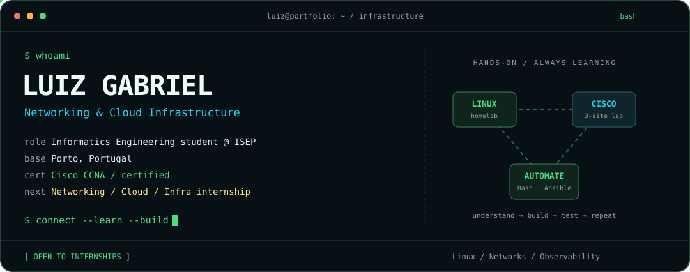
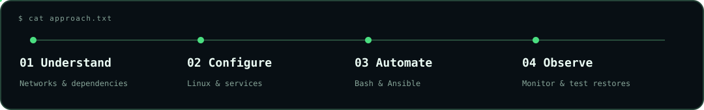

<!-- Version 3: Terminal / Network Lab. The original README.md is preserved. -->

<p align="center">
  
</p>

<h1 align="center"><code>luiz@infrastructure:~$</code> hello 👋</h1>

<p align="center"><strong>Luiz Gabriel · Networking &amp; Cloud Infrastructure</strong><br />Informatics Engineering @ ISEP · Porto, Portugal</p>

<p align="center">
  <a href="#whoami"><code>[ whoami ]</code></a> &nbsp;
  <a href="#ls-projects"><code>[ projects/ ]</code></a> &nbsp;
  <a href="#cat-toolboxconf"><code>[ toolbox.conf ]</code></a> &nbsp;
  <a href="#cat-learninglog"><code>[ learning.log ]</code></a> &nbsp;
  <a href="#connect"><code>[ connect ]</code></a>
</p>

<p align="center">
  <a href="https://www.credly.com/badges/eb7db229-ce66-423c-b955-08ab2ee8a014/public_url"></a>
  
  
</p>

## `whoami`

I'm **Luiz Gabriel**, a **CCNA-certified Informatics Engineering student at ISEP**. I work with Linux, build Cisco network labs, and use automation and monitoring to understand and maintain infrastructure.

My next step is an **internship in Networking, Cloud, Infrastructure or Systems Administration**.

```yaml
profile:
  based_in: Porto, Portugal
  education: Informatics Engineering @ ISEP
  graduation: June 2027 (expected)
  current_average: 15/20
  hands_on:
    - Daily-use Linux homelab
    - Three-site physical Cisco network lab
    - Wireless deployment for ISEP Career Summit
  direction: Networking + Linux -> Cloud infrastructure
```

## `ls projects/`

> 🟢 **Open a project below to inspect the implementation.** Repository links lead to the full documentation.

<details>
<summary><strong>🖥️ [01] linux-homelab/ — daily-use Linux infrastructure</strong></summary>

**2025 — Present** · **[Open repository ↗](https://github.com/LuizGabrielTeixeira/linux-homelab)**

```sh
linux-homelab/
├── platform       Linux · Docker Compose · persistent storage
├── remote-access  WireGuard · OpenVPN
├── dns            AdGuard Home
├── reverse-proxy  Nginx Proxy Manager
├── security       CrowdSec
├── monitoring     Prometheus · Grafana
└── operations     Bash · cron · backups · restore testing
```

<sub>Logical service inventory, not the repository's directory structure.</sub>

I administer a Linux server running containerized services used daily, manage deployments and storage, and maintain the services above. Bash scripts automate **scheduled backups, retention, restore testing and cleanup**.

**Operational focus:** keeping services observable and maintenance repeatable.

</details>

<details>
<summary><strong>🌐 [02] ccna-multisite-network/ — three sites, physical Cisco hardware</strong></summary>

**2026** · **[Open repository ↗](https://github.com/LuizGabrielTeixeira/ccna-multisite-network)**

| Layer | Implementation |
| :--- | :--- |
| **Routing & addressing** | IPv4/IPv6 · VLANs · inter-VLAN routing · OSPF over GRE/IPsec · NAT |
| **Redundancy** | HSRP · EtherChannel · Rapid STP |
| **Services** | DHCPv4/v6 · WLC-managed wireless / FlexConnect · VoIP |
| **Protection** | ACLs · port security · DHCP snooping · Dynamic ARP Inspection · BPDU Guard |
| **Operations** | Ansible configuration backups · LibreNMS · SNMP · Syslog · NTP |

**Operational focus:** connecting three sites while putting redundancy, security controls and monitoring into practice.

</details>

<details>
<summary><strong>📡 [03] isep-career-summit-wireless/ — an event deployment &amp; a troubleshooting story</strong></summary>

**2026** · **[Open repository ↗](https://github.com/LuizGabrielTeixeira/isep-career-summit-wireless)**

**Scope:** a three-day faculty event, with a wireless network **designed to support up to 100 users**.

**Equipment:** Catalyst 2960 PoE · 3 Cisco Aironet lightweight APs · Cisco Virtual WLC · external gateway/DHCP.

```text
Symptom     APs failing to join the WLC
Investigate AP/WLC logs + Cisco show commands
Trace       DHCP -> CAPWAP -> DTLS
Root cause  Expired AP MIC certificates
Resolution  WLC certificate-expiry workaround; AP registration restored
```

Also configured **dedicated management IP addressing, unused-port shutdown, a blackhole VLAN, PortFast and BPDU Guard**.

**Operational focus:** troubleshooting from evidence and restoring wireless registration.

</details>


<p align="center">
  
</p>

## `cat toolbox.conf`

<p align="center">
  
</p>

```sh
[networking]
platform  = Cisco IOS
protocols = TCP/IP, IPv4/IPv6, VLANs, OSPF, NAT, ACLs, DHCP, DNS, VPN

[systems]
platform  = Linux, Docker, Docker Compose
services  = Nginx / reverse proxy

[automation_and_observability]
tools     = Bash/Shell, Ansible, Git
telemetry = Prometheus, Grafana, LibreNMS, SNMP, Syslog

[programming]
languages = Java, Python, C, RISC-V Assembly, SQL
```

## `cat learning.log`

| State | Credential / training | Details |
| :--- | :--- | :--- |
| 🟢 **Certified** | **Cisco CCNA** | Aug 2026 — Aug 2029 · [Verify on Credly ↗](https://www.credly.com/badges/eb7db229-ce66-423c-b955-08ab2ee8a014/public_url) |
| 🟡 **In progress** | Fortinet NSE 4: FortiOS Administrator | Continuing my networking and security learning |
| 🔵 **Course only** | AWS Cloud Practitioner | Not certified |
| 🔵 **Course only** | AWS AI Practitioner | Not certified |

<details>
<summary><strong>🎓 Expand education &amp; language information</strong></summary>

**Bachelor's Degree in Informatics Engineering**  
[Instituto Superior de Engenharia do Porto](https://www.isep.ipp.pt/Course/Course/26) · February 2024 — June 2027 *(expected)*  
Current average: **15/20**

- **Portuguese:** native.
- **English:** B2, professional working proficiency · [EF SET certificate ↗](https://cert.efset.org/N61rZ2).
- **Spanish:** B1, limited working proficiency.

</details>

## `connect`

**Looking for an intern who enjoys Linux, networking and hands-on troubleshooting?** Let's talk about your infrastructure team.

<p align="center">
  <a href="https://www.linkedin.com/in/gsargaco/"></a>
  <a href="mailto:luizgabriellgsst@gmail.com"></a>
  <a href="./cvLuizTeixeira.pdf"></a>
</p>

<p align="center">
  
</p>
